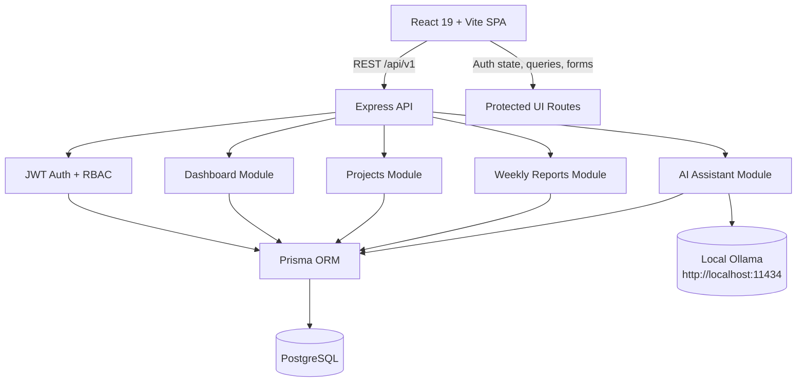

# Weekly Report Generator


Weekly Report Generator is a full-stack reporting platform for teams and managers. It combines JWT-secured authentication, role-based access control, weekly report management, project tracking, dashboard analytics, and a local Ollama-powered AI assistant in a single React + Express + Prisma application.

---

## Features

- JWT authentication with access and refresh token support.
- Role-based access control for Admin, Manager, and Team Member users.
- Protected routes and role-aware navigation in the frontend.
- Manager dashboard with summary metrics, charts, and recent activity views.
- Weekly report creation, editing, submission, viewing, and deletion for drafts.
- Manager reports view for reviewing team reporting activity.
- Project management with create, update, archive, list, and detail flows.
- AI Assistant powered by local Ollama, available to Manager/Admin users.
- Responsive interface across dashboard, reports, projects, profile, login, and register screens.
- Loading, error, and empty states across major pages and widgets.
- PostgreSQL database with Prisma ORM.
- Input and API validation using Zod and React Hook Form.

---

## Screenshots


---

## System Architecture



The frontend talks to the Express REST API. Authentication, dashboard data, projects, and reports are stored in PostgreSQL through Prisma. The AI assistant forwards context to a local Ollama instance for manager/admin chat responses.

---

## Tech Stack

| Layer | Technologies |
| --- | --- |
| Frontend | React 19, Vite, TypeScript, Tailwind CSS, shadcn/ui, Framer Motion |
| State/Data | TanStack Query, Axios, React Hook Form |
| Validation | Zod, React Hook Form resolver |
| Visualization | Recharts |
| Backend | Node.js, Express, TypeScript |
| Database | PostgreSQL, Prisma ORM |
| Authentication | JWT, bcrypt |
| AI | Ollama (local LLM) |
| Tooling | npm workspaces, ESLint, Prettier, tsx |

---

## Folder Structure

```text
weekly-report-generator/
├── apps/
│   ├── client/
│   │   └── src/
│   │       ├── api/
│   │       ├── app/
│   │       ├── components/
│   │       ├── constants/
│   │       ├── features/
│   │       ├── layouts/
│   │       ├── lib/
│   │       ├── pages/
│   │       ├── providers/
│   │       └── styles/
│   └── server/
│       ├── prisma/
│       │   ├── schema.prisma
│       │   ├── seed.ts
│       │   └── migrations/
│       └── src/
│           ├── config/
│           ├── constants/
│           ├── features/
│           ├── infrastructure/
│           ├── middleware/
│           ├── routes/
│           └── shared/
├── docs/
├── diagrams/
├── demo/
├── presentation/
├── package.json
└── README.md
```

---

## Installation

### 1) Clone the repository

```bash
git clone <repository-url>
cd weekly-report-generator
```

### 2) Install dependencies

```bash
npm install
```

### 3) Configure environment variables

Create the local environment files from the examples:

```bash
cp .env.example apps/server/.env
cp apps/client/.env.example apps/client/.env
```

Update `apps/server/.env` with your PostgreSQL connection string and secrets, then verify the Ollama settings:

```env
OLLAMA_BASE_URL=http://localhost:11434
OLLAMA_MODEL=llama3.2
```

### 4) Generate Prisma Client

```bash
npm run prisma:generate --workspace apps/server
```

### 5) Run database migrations

```bash
npm run prisma:migrate --workspace apps/server
```

### 6) Seed the database

```bash
npx prisma db seed
```

### 7) Start the application

Run both apps from the repository root:

```bash
npm run dev
```

If you want separate terminals:

```bash
npm run dev --workspace apps/server
npm run dev --workspace apps/client
```

---

## Environment Variables

### Client

| Variable | Required | Purpose |
| --- | --- | --- |
| `VITE_API_BASE_URL` | Yes | Base URL used by the client Axios instance to call the REST API. |

### Server

| Variable | Required | Purpose |
| --- | --- | --- |
| `NODE_ENV` | No | Controls runtime mode and server logging format. |
| `SERVER_PORT` | No | Port used by the Express API server. |
| `API_PREFIX` | No | Base path for all API routes. |
| `CORS_ORIGIN` | No | Allowed frontend origin for CORS. |
| `DATABASE_URL` | Yes | PostgreSQL connection string used by Prisma. |
| `JWT_ACCESS_SECRET` | Yes | Secret used to sign access tokens. |
| `JWT_REFRESH_SECRET` | Yes | Secret used to sign refresh tokens. |
| `JWT_ACCESS_EXPIRES_IN` | No | Access token lifetime. |
| `JWT_REFRESH_EXPIRES_IN` | No | Refresh token lifetime. |
| `OLLAMA_BASE_URL` | No | Local Ollama server URL used by the AI assistant. |
| `OLLAMA_MODEL` | No | Ollama model name used for chat responses. |

---

## Database

The Prisma schema models the core reporting workflow:

| Model | Purpose |
| --- | --- |
| `Role` | Stores the available user roles: Team Member, Manager, and Admin. |
| `User` | Stores user accounts, hashed passwords, activity state, and role assignment. |
| `Project` | Stores reportable projects and their lifecycle status. |
| `WeeklyReport` | Stores weekly status updates tied to a user, project, and week range. |
| `RefreshToken` | Stores refresh token hashes for session management and logout support. |

### Enums

| Enum | Values | Purpose |
| --- | --- | --- |
| `RoleName` | `TEAM_MEMBER`, `MANAGER`, `ADMIN` | User authorization levels. |
| `ReportStatus` | `DRAFT`, `SUBMITTED` | Weekly report lifecycle. |
| `ProjectStatus` | `ACTIVE`, `ON_HOLD`, `ARCHIVED` | Project lifecycle state. |

---

## Authentication

The authentication flow uses JWT and bcrypt:

- `POST /api/v1/auth/register` creates a user, hashes the password, and returns tokens.
- `POST /api/v1/auth/login` validates credentials and returns access/refresh tokens.
- `POST /api/v1/auth/logout` revokes the stored refresh token.
- `GET /api/v1/auth/me` returns the current authenticated user.
- Passwords are hashed with bcrypt on the server.
- Access tokens are used for API authorization.
- Refresh tokens are persisted in the database and revoked on logout.
- Protected routes block anonymous users in the frontend.
- Role checks guard manager/admin functionality.

---

## User Roles

| Role | Permissions |
| --- | --- |
| `Admin` | Full access to manager pages, dashboard analytics, projects, reports, and the AI assistant. |
| `Manager` | Access to dashboard analytics, projects, manager reports, settings, and the AI assistant. |
| `Team Member` | Access to their own reports, profile, and registration/login flows. |

The route guards in the frontend and authorization middleware in the backend enforce these permissions.

---

## Modules

### Authentication

Implements registration, login, logout, and current-user session hydration. The frontend includes dedicated login and register forms, field-level validation, and redirect handling after successful sign-in.

### Projects

Allows managers and admins to list, create, update, view, and archive projects. The UI includes search, status filters, tables, dialogs, loading skeletons, and error states.

### Weekly Reports

Allows authenticated users to create draft reports, update drafts, submit reports, view details, and delete drafts. The manager view also aggregates team activity across reports.

### Dashboard

Provides summary metrics, submission analytics, workload views, task trends, and recent activity filtering for managers and admins.

### AI Assistant

Provides a floating in-app assistant for manager/admin users. It sends project, user, and weekly report context to local Ollama and returns a concise markdown response.

### Profile

Displays the current authenticated user’s name, email, role, and account status.

### Settings

Allows local preference changes for theme, language, and notification toggles.

---

## Dashboard

The dashboard is backed by the following endpoints:

| Endpoint | Purpose |
| --- | --- |
| `GET /api/v1/dashboard/summary` | Returns counts for total reports, submitted reports, pending reports, compliance rate, and blockers. |
| `GET /api/v1/dashboard/activity?limit=50` | Returns recent report activity. |
| `GET /api/v1/dashboard/submission-status` | Returns submission compliance per member. |
| `GET /api/v1/dashboard/workload` | Returns report volume per project. |
| `GET /api/v1/dashboard/task-trends` | Returns weekly trends for report activity. |

The frontend widgets include:

- Summary cards for total reports, submitted reports, pending reports, compliance, and open blockers.
- Analytics cards for most active project, highest submission rate, and lowest submission rate.
- Submission status pie chart.
- Project workload bar chart.
- Weekly trend line chart.
- Recent activity table with search, project, status, and date filters.
- Skeleton and error states for both summary and analytics sections.

---

## AI Assistant

The AI Assistant uses a local Ollama server instead of a cloud API.

- It reads the model from `OLLAMA_MODEL` and the server URL from `OLLAMA_BASE_URL`.
- It works with the existing `/api/v1/ai/chat` endpoint.
- It includes context from users, projects, and weekly reports.
- It is restricted to Manager and Admin users.
- It returns responses in markdown and supports suggested prompts, loading states, and error states.
- No cloud API key is required.

---

## REST API

### Authentication

| Method | Endpoint | Access |
| --- | --- | --- |
| `POST` | `/api/v1/auth/register` | Public |
| `POST` | `/api/v1/auth/login` | Public |
| `POST` | `/api/v1/auth/logout` | Authenticated |
| `GET` | `/api/v1/auth/me` | Authenticated |

### Users / Profile

| Method | Endpoint | Access |
| --- | --- | --- |
| `GET` | `/api/v1/users/me` | Authenticated |

### Projects

| Method | Endpoint | Access |
| --- | --- | --- |
| `GET` | `/api/v1/projects` | Authenticated |
| `POST` | `/api/v1/projects` | Manager/Admin |
| `GET` | `/api/v1/projects/:id` | Authenticated |
| `PUT` | `/api/v1/projects/:id` | Manager/Admin |
| `DELETE` | `/api/v1/projects/:id` | Manager/Admin |

### Weekly Reports

| Method | Endpoint | Access |
| --- | --- | --- |
| `GET` | `/api/v1/reports` | Authenticated |
| `POST` | `/api/v1/reports` | Authenticated |
| `GET` | `/api/v1/reports/:id` | Authenticated |
| `PUT` | `/api/v1/reports/:id` | Authenticated |
| `POST` | `/api/v1/reports/:id/submit` | Authenticated |
| `DELETE` | `/api/v1/reports/:id` | Authenticated |

### Dashboard

| Method | Endpoint | Access |
| --- | --- | --- |
| `GET` | `/api/v1/dashboard/summary` | Manager/Admin |
| `GET` | `/api/v1/dashboard/activity` | Manager/Admin |
| `GET` | `/api/v1/dashboard/submission-status` | Manager/Admin |
| `GET` | `/api/v1/dashboard/workload` | Manager/Admin |
| `GET` | `/api/v1/dashboard/task-trends` | Manager/Admin |

### AI

| Method | Endpoint | Access |
| --- | --- | --- |
| `POST` | `/api/v1/ai/chat` | Manager/Admin |

### Health

| Method | Endpoint | Access |
| --- | --- | --- |
| `GET` | `/api/v1/health` | Public |

---

## Validation

- `Zod` validates environment variables, request payloads, and form schemas.
- `React Hook Form` manages client-side form state and submission.
- `validateRequest` middleware enforces backend request validation before controllers run.
- Route guards and authorization middleware protect authenticated and role-specific pages.

---

## Testing

Run the project checks from the repository root:

```bash
npm run lint
npm run typecheck
npm run build
npm run prisma:generate --workspace apps/server
npx prisma db seed
```

---

## Deployment

For a local production-style run:

1. Install dependencies with `npm install`.
2. Configure `apps/server/.env` and `apps/client/.env`.
3. Run `npm run prisma:generate --workspace apps/server`.
4. Run `npm run prisma:migrate --workspace apps/server`.
5. Seed the database with `npx prisma db seed`.
6. Build the workspaces with `npm run build`.
7. Start the server with `npm run start --workspace apps/server`.
8. Preview the client with `npm run preview --workspace apps/client`.

For development, `npm run dev` starts both workspace dev servers.

---

## Future Improvements

- PDF export for weekly reports.
- Email notifications for report submission and follow-up.
- Docker-based local deployment.
- CI/CD automation.
- Cloud deployment support.

---

## Author

Project information available in the repository:

- Repository: weekly-report-generator
- Package manager: npm workspaces

Placeholders:

- GitHub: [your-handle](https://github.com/your-handle)
- LinkedIn: [your-profile](https://www.linkedin.com/in/your-profile)
- Portfolio: [your-portfolio](https://your-portfolio.example)
- Email: your.email@example.com

---

## License

MIT License

Copyright (c) 2026

Permission is hereby granted, free of charge, to any person obtaining a copy of this software and associated documentation files, to deal in the Software without restriction, including without limitation the rights to use, copy, modify, merge, publish, distribute, sublicense, and/or sell copies of the Software, and to permit persons to whom the Software is furnished to do so, subject to the following conditions:

The above copyright notice and this permission notice shall be included in all copies or substantial portions of the Software.

THE SOFTWARE IS PROVIDED "AS IS", WITHOUT WARRANTY OF ANY KIND, EXPRESS OR IMPLIED, INCLUDING BUT NOT LIMITED TO THE WARRANTIES OF MERCHANTABILITY, FITNESS FOR A PARTICULAR PURPOSE AND NONINFRINGEMENT. IN NO EVENT SHALL THE AUTHORS OR COPYRIGHT HOLDERS BE LIABLE FOR ANY CLAIM, DAMAGES OR OTHER LIABILITY, WHETHER IN AN ACTION OF CONTRACT, TORT OR OTHERWISE, ARISING FROM, OUT OF OR IN CONNECTION WITH THE SOFTWARE OR THE USE OR OTHER DEALINGS IN THE SOFTWARE.
